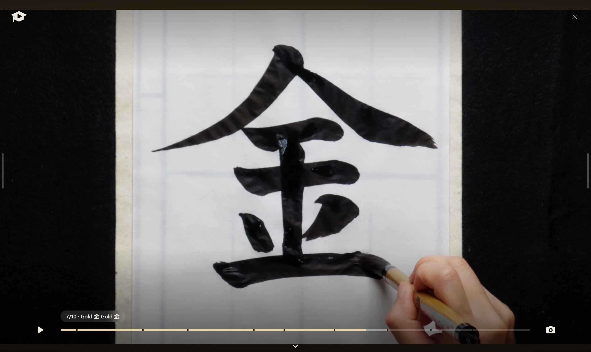
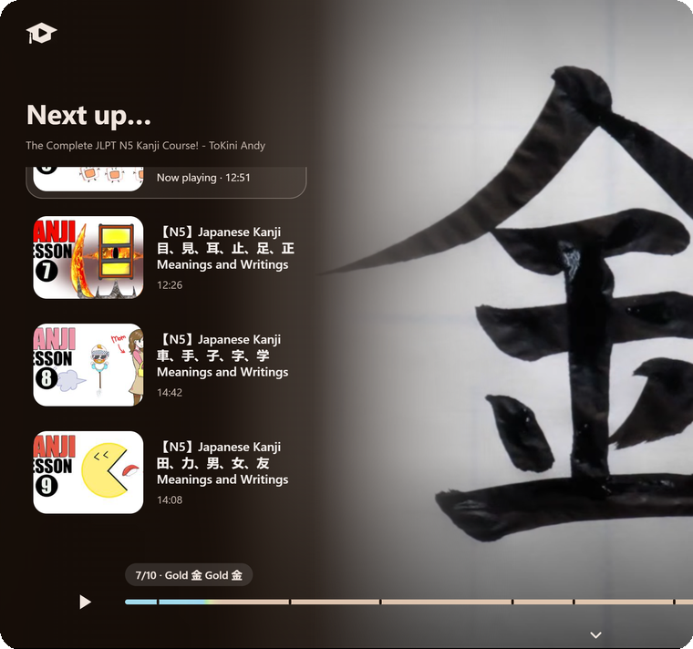
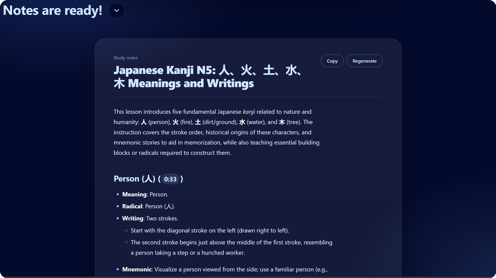
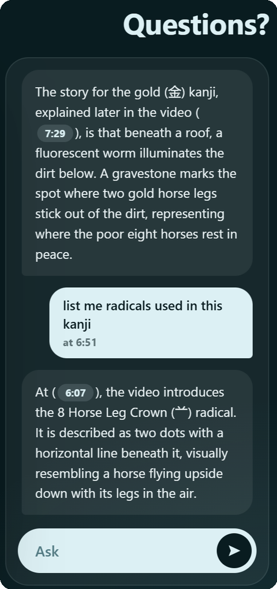
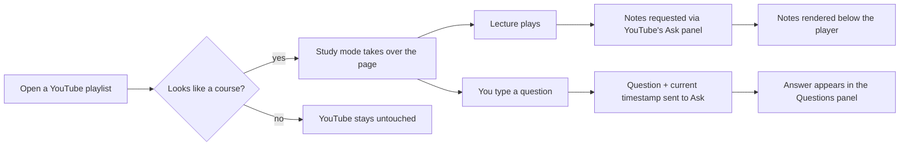

<div align="center">


<h1>CourseTube</h1>

<p><b>Turn any YouTube course playlist into a calm, distraction-free study space.</b><br>
Instant AI notes · Ask questions about the exact moment you're watching · One-click lecture hopping</p>

<p>


</p>

<br>



</div>

<br>

## ✨ Why CourseTube?

YouTube is a wonderful classroom and a terrible study desk: recommendations, comments, autoplay rabbit holes. **CourseTube spots course playlists and rebuilds the page around learning**, so the lecture, the syllabus, your notes and your questions all live on one screen.

## 🎬 Features

<table>
<tr>
<td width="56%" valign="top">

### 🧭 Smart course detection
Open a lecture playlist and study mode switches on automatically. Not a course? It stays out of your way. One click on the **🎓 Study mode** button turns it on anywhere, and <kbd>Esc</kbd> brings YouTube back.

### 📚 Scrollable "Next up…" playlist
The whole syllabus with thumbnails and durations. Jump lectures in one click, with a smooth crossfade between videos and no flash of YouTube's interface.

### 🎛️ A player that gets out of the way
Big rounded video, a silky seek bar with hover timestamps, controls that fade while you watch, and a **📸 screenshot button** that saves *and* copies the current frame.

</td>
<td width="44%" align="center">

</td>
</tr>
</table>

### 📝 Notes that write themselves
The moment a lecture starts playing, CourseTube asks Gemini (through YouTube's own **Ask** panel) for detailed study notes: overview, sections, definitions, examples, key takeaways and self-test questions. Every timestamp is a **clickable chip** that jumps the video to that moment, and notes are cached so they're instant next time.

<div align="center">

</div>

<br>

<table>
<tr>
<td width="42%" align="center">

</td>
<td width="58%" valign="top">

### 💬 Questions? Ask away
Type a question in the **Ask** pill and get an answer tied to *where you are in the lecture* ("what did he say about rice fields?" really works). Answers keep their formatting and include clickable timestamps, and your history stays in the panel while you watch.

### 🔒 Private by design
No accounts, no analytics, no servers. Notes live in your browser's local storage. Questions go through YouTube's own Ask feature, exactly as if you'd typed them there.

</td>
</tr>
</table>

## ⚙️ How it works



CourseTube is a content script with no backend. It re-homes YouTube's real player into its own layout (so playback, quality and captions keep working) and drives the built-in **Ask** UI to get Gemini's replies.

## 🚀 Install

**Store versions:** Chrome Web Store · Firefox Add-ons *(links coming soon)*

**From source (works today):**

<details>
<summary><b>Chrome / Edge / Brave</b></summary>

1. Download or clone this repo.
2. Open `chrome://extensions` and switch on **Developer mode**.
3. Click **Load unpacked** and choose the `extension/` folder.

</details>

<details>
<summary><b>Firefox</b></summary>

1. Download or clone this repo, then copy `extension/manifest.firefox.json` over `extension/manifest.json` (or run `./build.sh` and use `dist/firefox`).
2. Open `about:debugging#/runtime/this-firefox`.
3. Click **Load Temporary Add-on…** and pick `manifest.json`.

</details>

Or build store-ready zips for both browsers:

```bash
./build.sh   # → dist/coursetube-chrome.zip and dist/coursetube-firefox.zip
```

## 🧪 Good to know

- **Notes and Q&A need YouTube's "Ask" feature** to be available for your account and the video. YouTube is rolling it out gradually.
- Because there's no public API for Ask, CourseTube operates its on-page UI. If YouTube redesigns that panel, the finders at the top of `extension/content.js` (the `Gemini` block) may need a small tweak. Issues and PRs are welcome.
- AI notes can be wrong, so double-check anything important.

## 🗂️ Project structure

```
coursetube/
├── extension/
│   ├── manifest.json            # Chrome / Edge / Brave
│   ├── manifest.firefox.json    # Firefox variant
│   ├── content.js               # detection, UI, player, notes, Q&A, Ask bridge
│   ├── content.css              # the whole look & feel
│   └── icons/
├── assets/                      # logo + README images
├── build.sh                     # makes the store zips
├── PRIVACY.md
└── LICENSE
```

## 🛣️ Ideas for later

- Transcript + your own Gemini API key as a fallback when Ask isn't available
- Export notes to Markdown / PDF
- Per-lecture bookmarks and highlights
- Keyboard shortcuts and a light theme

## 🤝 Contributing

Bug reports, ideas and pull requests are very welcome. Open an issue first for bigger changes. If you're reporting a broken Ask integration, mention your browser and whether the Ask button appears under the video on YouTube.

## 📄 License

[MIT](LICENSE). Free to use, change and share.

<sub>CourseTube is an independent project and is not affiliated with or endorsed by YouTube or Google. The screenshots show the "Complete JLPT N5 Kanji Course" by ToKini Andy for demonstration; all course content belongs to its creator.</sub>

<div align="center"><br><sub>Made for learners who just want to press play and focus. 🎓</sub></div>
