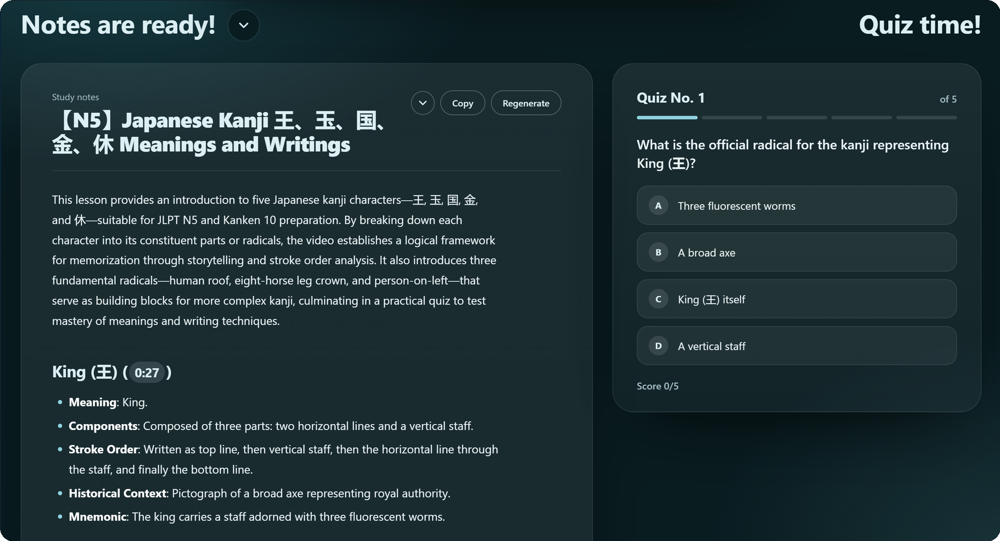
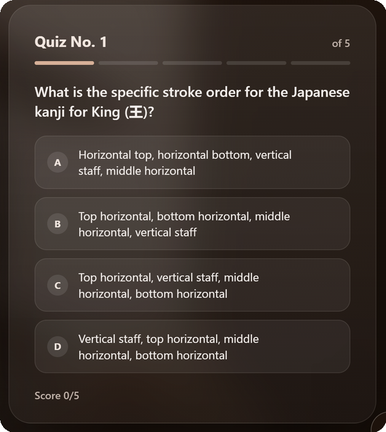
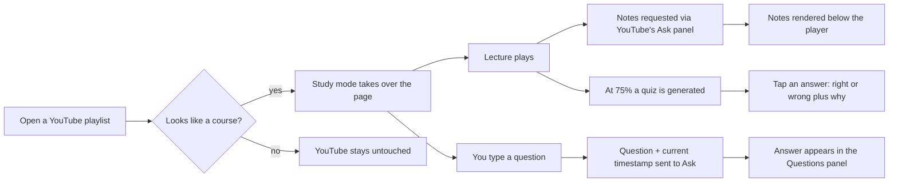

<div align="center">


<h1>CourseTube</h1>

<p><b>Turn any YouTube course playlist into a calm, distraction-free study space.</b><br>
Instant AI notes · Quizzes that unlock as you learn · Ask about the exact moment you're watching · One-click lecture hopping</p>

<p>


</p>

<br>


</div>

<br>

## ✨ Why CourseTube?

YouTube is a wonderful classroom and a terrible study desk: recommendations, comments, autoplay rabbit holes. **CourseTube spots course playlists and rebuilds the page around learning**, so the lecture, the syllabus, your notes and your questions all live on one screen.

## 🎬 Features

### 🧭 Smart course detection
Open a lecture playlist and study mode switches on automatically. Only playlists that look like real study material qualify (course words in many languages, educational channels, lecture-length videos), so music, gaming and everyday playlists are never touched. Missed one? Press <kbd>Alt</kbd>+<kbd>Shift</kbd>+<kbd>S</kbd>. <kbd>Esc</kbd> brings YouTube back.

### 🎛️ A full-screen player that gets out of the way
The lecture fills the window and everything else stays quiet until you need it. The bars around the video glow with the lecture's colour instead of black, and the whole screen keeps that one colour for the entire lecture, with chapter dividers, the current chapter title and hover timestamps. Controls fade while you watch, and a **📸 screenshot button** saves *and* copies the current frame. The little logo in the corner shows the lecture title when you hover it and cheers you on at 25%, 50% and 75%.

### ⬅️ ➡️ Playlist and questions, one glide away

<table>
<tr>
<td width="50%" align="center">
<br>
<sub><b>Hover the left edge</b> and the whole syllabus glides out. Jump to any lecture in one click.</sub>
</td>
<td width="50%" align="center">
<br>
<sub><b>Hover the right edge</b> and ask. Answers are tied to the exact moment you are at.</sub>
</td>
</tr>
</table>

Both panels slide over a soft colour blur and the video keeps playing underneath. Answers keep their formatting and include clickable timestamps, and each lecture keeps its own question history. Switching lectures fades smoothly, with no flash of YouTube's interface.

### 📝 Notes that write themselves
The moment a lecture starts playing, CourseTube asks Gemini (through YouTube's own **Ask** panel) for study notes and turns them into a structured sheet: an overview, a clickable contents row, numbered sections with timestamp chips, term and definition rows, example callouts, key takeaways and self-test questions. Scroll down and they spring up over the video. Notes are cached, so they are instant next time, and the panel folds away when you want more room.

<div align="center">

</div>

<br>

<table>
<tr>
<td width="55%" valign="top">

### 🧠 Quiz time!
At **75%** of the lecture, CourseTube asks Gemini for five multiple-choice questions on what you've covered. Tap an answer and you instantly see ✓ right or ✕ wrong, plus a short explanation right underneath, then move on to the next one and finish with your score. Until then it shows how close you are to unlocking it.

</td>
<td width="45%" align="center">

</td>
</tr>
</table>

### 🔒 Private by design
No accounts, no analytics, no servers. Notes and quiz questions live in your browser's local storage. Questions go through YouTube's own Ask feature, exactly as if you'd typed them there.

## 🆕 What's new

**2.2.2**

- **One colour per lecture.** The theme is chosen once when a lecture starts and then stays put, instead of drifting while you watch.
- **Fewer missed courses.** Study-playlist detection now waits for the playlist to finish loading, never remembers a "no", and also recognises course words in other languages, subject names, educational channels and long lecture-length videos. Music, gaming and vlog playlists are still left alone.

**2.2**

- **Notes are now a real study sheet.** CourseTube asks Gemini for a labelled outline and builds the layout itself: overview, clickable contents, numbered sections with timestamp chips, term and definition rows, example callouts, key takeaways and self-test questions.
- **Notes start by themselves on every lecture.** Requests that get lost when YouTube resets its Ask panel are resent automatically, with one automatic retry, so there is no need to press Regenerate.
- **No YouTube UI during lecture changes.** The player stays hidden until the new lecture is really playing, YouTube's loading spinner is hidden, and the overlay can no longer be switched off from outside.
- **Messages from the logo stay on a single line.**

**2.1**

- **A smaller, calmer logo.** Just the logo sits top-left; hover it and the lecture title floats out in a little thought-bubble pill. The encouragement messages (25%, 50%, 75% and finish, plus "notes ready" and "quiz ready") pop out in the same pill, with warmer, more expressive wording.
- **Notes as a structured study sheet:** an overview, a clickable table of contents, numbered section cards, tidy label/value rows for definitions, a highlighted Key takeaways card and numbered self-test questions, with reading time.
- **Springy rise.** Notes and quiz bounce up as you scroll down.
- **A quiet arrow** under the progress bar replaces the old hint pill.
- **Questions?** now sits at the left of the history panel, lined up with the playlist's panel.
- Chapter titles are now filled in from the video description when YouTube's own list has none.

**2.0, a complete redesign**

- **🎬 Full-screen player.** The lecture fills the window; letterbox bars glow with the lecture's colour instead of black.
- **👋 A logo that talks.** It sits top-left and pops a thought bubble to cheer you on at 25%, 50% and 75%, and to tell you when your notes and quiz are ready.
- **⬅️ Hover left for the playlist, ➡️ hover right for questions**, each gliding out over a soft, progressive colour blur.
- **⬇️ Scroll down for notes and quiz.** They rise over the video while a colour blur slowly takes over as you scroll.
- **🎓 Welcome tour** for first-time users (click the logo any time to replay it).
- **🎯 Study playlists only.** Detection now needs real evidence (course words, lecture numbering, Education category) and is vetoed by music/gaming/vlog signals, so other playlists are never touched. The launcher button only appears on recognised study playlists. Missed one? Press <kbd>Alt</kbd>+<kbd>Shift</kbd>+<kbd>S</kbd> on the playlist page.
- Smoother lecture changes (fade to the ambient colour, no YouTube UI splash), plus the usual speed-ups.

**1.6**

- **🧠 The quiz now arrives at 75%** of the lecture, so it covers what you've actually learned.
- **💬 Kind words along the way.** Until the quiz unlocks, an encouraging message appears where the "Quiz time!" heading will be and changes every so often as you pass milestones.

**1.5**

- **🧠 Quiz time!** At 75% of a lecture, CourseTube asks Gemini for five multiple-choice questions on what you've covered. Tap an answer to see ✓ right / ✕ wrong instantly, with a short explanation right below, then move to the next question and finish with your score.
- **🎨 Colours that follow the lecture.** The background, text and Ask box take their colour from the video (using YouTube's own description-box colour, with a video-frame fallback) and glide smoothly from lecture to lecture.
- **📍 Chapters on the seek bar.** Chapter dividers appear on the progress bar and hovering shows the chapter title.
- **🗂️ Collapsible notes**, sitting beside the quiz, and your choice is remembered.
- **⚡ Faster everywhere:** the study UI is pre-built while the page loads, the Ask panel is warmed up before the first request, the playlist only re-renders when it changes, and the seek bar uses GPU transforms.
- The **Questions?** heading now sits flush with the right edge of the chat panel, and there's a new logo, cut out and tinted in the lecture's colour.

## ⚙️ How it works



CourseTube is a content script with no backend. It re-homes YouTube's real player into its own layout (so playback, quality and captions keep working) and drives the built-in **Ask** UI to get Gemini's replies.

## 🚀 Install

**Store versions:** Chrome Web Store · Firefox Add-ons *(links coming soon)*

**From source (works today):**

<details>
<summary><b>Chrome / Edge / Brave</b></summary>

1. Download or clone this repo.
2. Open `chrome://extensions` and switch on **Developer mode**.
3. Click **Load unpacked** and choose the `extension/` folder.

</details>

<details>
<summary><b>Firefox</b></summary>

1. Download or clone this repo, then copy `extension/manifest.firefox.json` over `extension/manifest.json` (or run `./build.sh` and use `dist/firefox`).
2. Open `about:debugging#/runtime/this-firefox`.
3. Click **Load Temporary Add-on…** and pick `manifest.json`.

</details>

Or build store-ready zips for both browsers:

```bash
./build.sh   # → dist/coursetube-chrome.zip and dist/coursetube-firefox.zip
```

## 🧪 Good to know

- **Notes and Q&A need YouTube's "Ask" feature** to be available for your account and the video. YouTube is rolling it out gradually.
- Because there's no public API for Ask, CourseTube operates its on-page UI. If YouTube redesigns that panel, the finders at the top of `extension/content.js` (the `Gemini` block) may need a small tweak. Issues and PRs are welcome.
- CourseTube only activates on playlists that look like study material (press <kbd>Alt</kbd>+<kbd>Shift</kbd>+<kbd>S</kbd> to force it on one it missed).
- AI notes can be wrong, so double-check anything important.

## 🗂️ Project structure

```
coursetube/
├── extension/
│   ├── manifest.json            # Chrome / Edge / Brave
│   ├── manifest.firefox.json    # Firefox variant
│   ├── content.js               # detection, UI, player, notes, Q&A, Ask bridge
│   ├── content.css              # the whole look & feel
│   └── icons/
├── assets/                      # logo + README images
├── build.sh                     # makes the store zips
├── PRIVACY.md
└── LICENSE
```

## 🛣️ Ideas for later

- Transcript + your own Gemini API key as a fallback when Ask isn't available
- Export notes to Markdown / PDF
- Spaced-repetition review of the quiz questions you missed
- Per-lecture bookmarks and highlights
- Keyboard shortcuts and a light theme

## 🤝 Contributing

Bug reports, ideas and pull requests are very welcome. Open an issue first for bigger changes. If you're reporting a broken Ask integration, mention your browser and whether the Ask button appears under the video on YouTube.

## 📄 License

[MIT](LICENSE). Free to use, change and share.

<sub>CourseTube is an independent project and is not affiliated with or endorsed by YouTube or Google. The screenshots show the "Complete JLPT N5 Kanji Course" by ToKini Andy for demonstration; all course content belongs to its creator.</sub>

<div align="center"><br><sub>Made for learners who just want to press play and focus. 🎓</sub></div>
